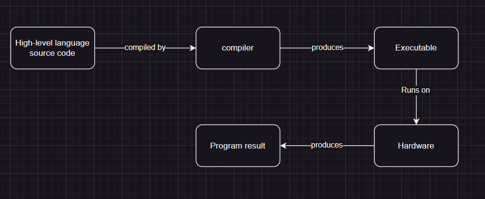
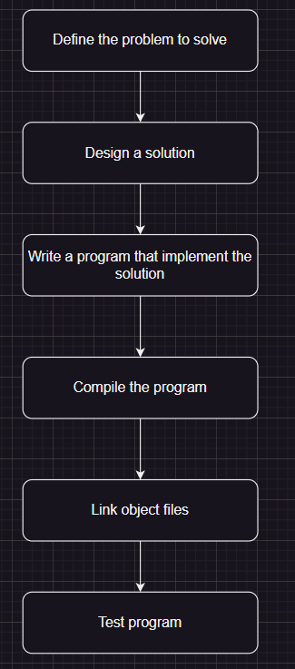
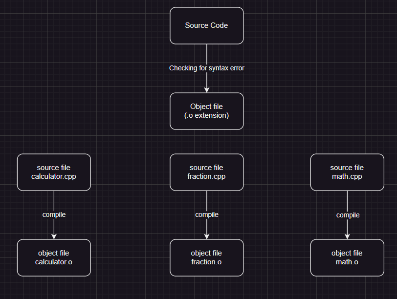
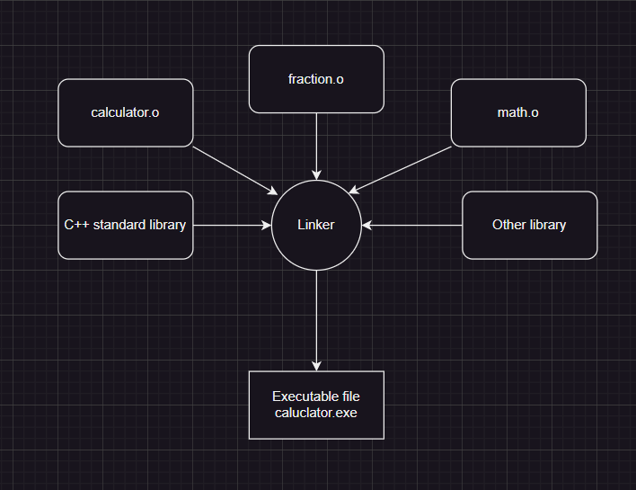

# C++ Introduction

## Introduction
- Avoid twin evils the ellipses(also known as ....), in code examples, where a necessary or non-obvious part of an example is ommitted in interest of spaces.
- Teaches how to program and how not to program.
- Lot of example and practice problems.

**Application:** A computer program/application is a set of instruction that a computer casn perfrom in order to perform a specific task.

**Programming:** Programming is the process of writing a computer program.

**Code:** A list of commands typed into one or more text files

#### Compiling process

**C and C++'s philosophy:** Trust the programmer.(Both wonderful and dangerous)

#### Steps to develop C++ program

**Step 1 (What) step:** IN this step we figure out what problem we are intending to solve.
e.g. "I want to write a program that will allow me to enter many numbers, then calcualtes the average of those numbers."

**Step 2 (How) step:** In this step we figure out how to solve the problem you came up with in step 1.
e.g. "I will use a vector to store the numbers, then I will use a for loop to sum the numbers, then I will divide the sum by the number of numbers to get the average."

**A good solution characterstics**
- They are straightforward
- Well documented(around assumption and limitations)
- They are build modularly
- They are robust

**Step 3 (Code) step:** In this step we write the code to implement the solution we came up with in step 2.

**Best practice:** Name your code file "something.cpp", where something is an name of your choosing and ".cpp" is the extension that indicates the files is a C++ source file.

**Step 4 (Compile) step:** In this step we compile our source code

**Step 5 (linking) step:** In this step the object files and libraries are linked together by the linker to produce and executable.

**Note:** A linker is reponsible for linking all the functions and libraries in a multi-file project.

## IDE(Integrated Development Environment)

**Project** - A project is a container that holds all of your source code file, images, data files, etc.

**Best practice:** Create a new project for each new program you write.

**Workspace/solution:** It is a container that can hold one or more related project.
for e.g. :- If you are writing a game and wanted to have separate executables for single and mulitplayer.

#### Difference between the compile, build, rebuild, clean and run/start.

**Note:** Usually object files are discarded once linked, but the IDE may cached these object for fast compilation in sub-sequent compilaions
1. Build: Compiles all modified code file in the project.
1. Clean: removes all cached object and executable so the next time project is build all files are recompiled.
1. Rebuild: Does a "clean", followed by a "build".
1. Compile: Recompiles a single code file(even if it has been cached previously)
1. Run/start: Executes the executable from the prior build.

## Configuring your compiler

#### Setting build configuration
**Build configuration:** It is a collection of project setting that determines how your IDE will build your project. Build configuration inludes what executables will be named, where to look for library files, etc.

**Two common build config**
1. Debug config: It is designed to help you debug your program. Truns of all optimization, and includes debugging information.
1. Release config: It is designed to be used when releasing your program to the public. Useful for testing speed and performance of your program.

#### **Disabling compiler extension**

**Steps for disabling compiler extension**
- Right-click on "project anme" in solution explorer
- choose properties
- Select configuration: All cofiguration(If not selected already)
- Click C/C++ > language tab
- Set "conformance mode" to **Yes(/permissive -)**

**Best practice:** Disable compiler extension to ensure our program remains complaint with C++ standard and will work on any system. 

#### **Increasing warning level VS 2022**
**Warnings:** Warning are code that compiler might think to be an error, but it can't be sure warning do not halt a program's compilation like and error does.

**Steps for increasing warning level**
- Right-click on "project anme" in solution explorer
- choose properties
- Select configuration: All cofiguration(If not selected already)
- Click C/C++ > language tab
- Set warning level to level 4(/W4)

**Note:** Do not choose **"EnableAllWarnings"** it will give useless warnings.

**Best practice:** Don't let warning pile up, resolve them as your encounter them. Otherwise a warning about a serious issue may be lost amongst warning about non-serious issues.

**Best practice:** Turn your warning level up to the maximum, especially whiel you are learning. It will help you identify possible issues.

#### Enabling "Treat warning as error"

**Step for enabling treat warning as error**
- Right-click on "project anme" in solution explorer
- choose properties
- Select configuration: All cofiguration(If not selected already)
- Click C/C++ > language tab
- Set "Treat warning as Errors" to yes.

#### Choosing a language standard(per project basis)

Setting us VS 2022 for C++17 or C++20

**Note:** There is currently no way to enable a newer language standard globally, we must do so on a per project basis.

**Warning:** With VS 2022 we need to reselect our language standard every time we create a new project.

**Steps for selecting a language standard**
- Right-click on "project anme" in solution explorer
- choose properties
- Select configuration: All cofiguration(If not selected already)
- Click C/C++ > language tab
- Choose "C++ language standard standard" for your project

**Note:** Select ISO C++ latest(/std:c++ latest)

#### Creating a template in VS 2022

**Step for creating a template for project in VS 2022**
- Project -> Export template
- Select project template
- Add a name and optional description
- Click "finish"

**Note:** For setting all these options in VS code we can add the respective flags in task.json file in the 'args' sections.